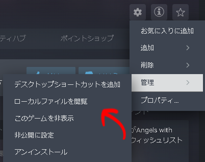

# AwSW Mod 日本語訳Mod

## ダウンロード

[こちら](https://github.com/drago-suzuki58/AwSWMod-Japanese/archive/refs/heads/master.zip)からダウンロードしてください。

## 使い方

1. ダウンロードしたZIPファイルを解凍
2. SteamのAwSWの画面から、歯車マークをクリック  
   
3. 管理からローカルファイルを閲覧をクリック  
   
4. gameフォルダをダブルクリック  
   
5. modsフォルダに解凍したファイルをドロップ  
   

または、[こちら](https://konaominecraftmod.hatenablog.com/entry/awswmod)のリンクの導入方法を参照してください。

## 対応Mod

- [Core Mod](https://steamcommunity.com/sharedfiles/filedetails/?id=1305731599)
- [MagmaLink](https://steamcommunity.com/sharedfiles/filedetails/?id=2594080243)
- [Mod Conflict Avoidance](https://steamcommunity.com/sharedfiles/filedetails/?id=2961467898)
- [Adine Romance Ending](https://steamcommunity.com/sharedfiles/filedetails/?id=1368945061)

## 更新履歴

- 2024/05/15 : v0.1
  - [Adine Romance Ending](https://steamcommunity.com/sharedfiles/filedetails/?id=1368945061)の翻訳を追加
- 2024/05/16 : v0.1.1
  - 本編の翻訳パッチを追加
- 2024/05/16 : v0.2
  - Core modの翻訳を追加
- 2024/05/16 : v0.3
  - [Mod Conflict Avoidance](https://steamcommunity.com/sharedfiles/filedetails/?id=2961467898)の翻訳を追加
- 2024/05/16 : v0.4
  - [MagmaLink](https://steamcommunity.com/sharedfiles/filedetails/?id=2594080243)の翻訳を追加
- 2024/05/16 : v0.4.1
  - Pythonで動く自動翻訳ツールを追加
    詳細は[tools_readme](tools/tools_readme.md)を参照
- 2024/05/16 : v0.4.2
  - 自動翻訳ツールの一部の問題を解消

## 自動翻訳ツールについて

このリポジトリのtoolsフォルダに、Google翻訳を利用して使える簡単なMod翻訳ツールを追加しました。

詳細な使い方などは[tools_readme](tools/tools_readme.md)を参照してください。

## ライセンスと帰属について(About License and Attribution)

このリポジトリで翻訳しているModの元テキストはそれぞれの著作者に帰属します。各Modのライセンスは、それぞれのリンク先や配布元で確認してください。

このリポジトリには元のModのファイルは含まれておらず、翻訳テキストのみが含まれています。翻訳は未許可で行われていますが、これは元のModの価値を高め、別の言語でより多くの人々がそれを楽しめることを目指しています。決して元のModへの侵害を目的としていません。

The original text of the Mods translated in this repository belongs to their respective authors. Please check the licenses of each Mod at their respective links or distribution sources.

This repository does not contain the original Mod files, only the translated texts. The translations are done without permission, but this is aimed at enhancing the value of the original Mods and allowing more people to enjoy them in a different language. It is never intended to infringe upon the original Mods.

## 削除希望について(About delete request)

もし、このリポジトリの内容について削除を希望する場合は、元になったModの作者、またはAwSWの作者のみが"delete request"タグを用いてIssueを作成してリクエストを送れます。

If you wish to have any content in this repository removed, only the original Mod author or the AwSW author can create an Issue with the "delete request" tag to make a request.

## 翻訳の改善について

翻訳の改善や修正、追加は大歓迎です。

翻訳に関する問題や提案がある場合は、Issueを作成してください。Issueを作成する際は、問題の詳細や提案の内容を具体的に記述してください。

## 使用させていただいたツール

[AwSW-Translator-Toolkit](https://github.com/4onen/AwSW-Translator-Toolkit)

## 連絡先(Contact)

何か質問や提案がある場合、または単にフィードバックを送りたい場合は、以下の連絡先までお気軽にご連絡ください：

- Email: [drsz@dorasuzublog.com](mailto:drsz@dorasuzublog.com)
- Discord: @drago_suzuki58
