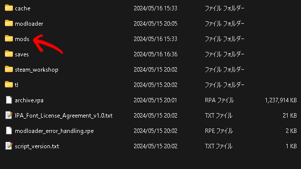

# 自動翻訳ツール

## 使い方

1. GoogleTranslateモジュールがインストールされていないのであれば、```pip install googletrans==3.1.0a0```を実行してインストール
2. [AwSW-Translator-Toolkit](https://github.com/4onen/AwSW-Translator-Toolkit)Modをインストール
3. 同じく、このリポジトリのModもインストールしておく
4. インストールして起動できたら真ん中にある```Mod Translation```を選択
   
5. するとこのような画面になるので、一番右上の```Gen untranslated.txt```を選択
   
6. そうするとこのような表示が出るのではいを選択
   
7. ゲームを閉じて、AwSWのルートフォルダに行くと```untranslated.txt```が生成されているので、適当なフォルダに移動させる
   
8. このフォルダの```all_auto_translate.py```を開いて、10行目の```directory```変数を先ほど```untranslated.txt```を入れたフォルダの絶対パスか相対パスにする
9. 次に、このフォルダでコマンドプロンプトを開いて、```python all_auto_translate.py```を実行して待つ
10. しばらくすると```untranslated.txt```と同じフォルダにAwSWMod-Japaneseというフォルダが出来るので、そのフォルダごとmodsフォルダに入れる
    
11. 最後に、ゲームを正常に動作させるためにcacheフォルダを丸ごと削除してください
    

このツールはPython3.11.9を使用しているので、動かない場合はバージョンを変えて試行してみてください。

もし疑問がある場合はissueなどでお尋ねください。

## 出力されるファイル

出力ファイルは、

- ファイルの行番号をソートしたファイル (output_*.tsv)
- 翻訳したファイル (translated_output_*.tsv)
- Ren'Pyのスクリプトファイル (*.rpy)

が生成されます。実行後は消しても構いません。

## 高度な使用方法

モジュールとして使用されている他のPythonファイルは、どれも単体で動くように設計されています。手動翻訳したファイルをrpyファイルにするときや、ファイルを修正したときなどに役に立ちます。

## 既知の問題

- GoogleTranslateにセリフを入れた際に、```[player_name]```変数も翻訳してしまい、プレイヤー名が呼ばれない問題
